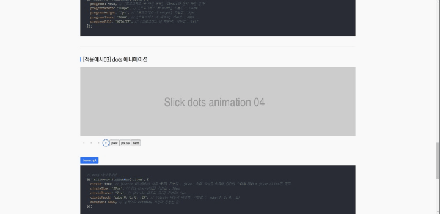

# 🔌slickNav.js

[kenwheeler의 slick.js](https://kenwheeler.github.io/slick/) 플러그인에 네비게이션을 추가한 확장 Plugin 입니다.
slickNav.js는 slick.js 플러그인에서 제공되지 않는 play/pause 버튼 및 슬라이더 컨트롤 네비게이션 UI을 간단한 설정만 제공하는 확장 플러그인입니다.

[📃Demo](https://kyoungsic-dev.github.io/slick-nav)
